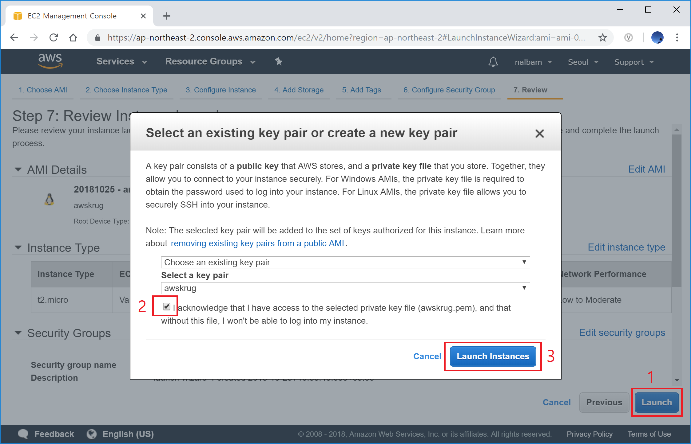
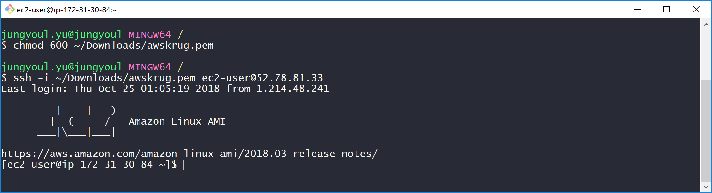
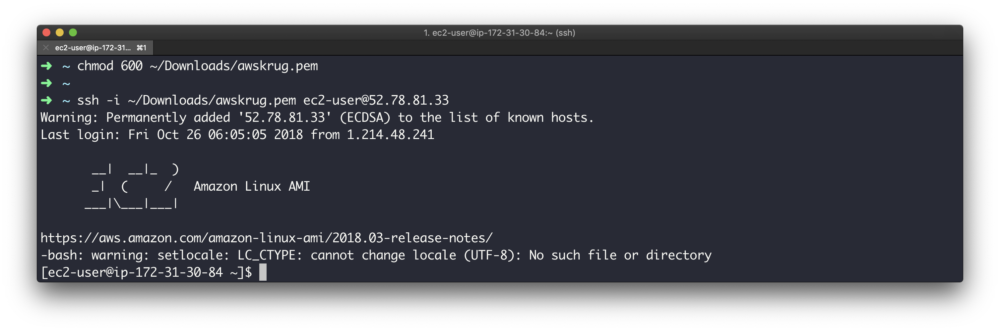
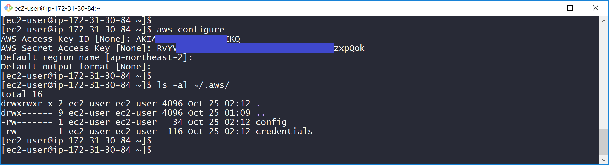

# Kubernetes Hands-on

## Index

<!-- TOC depthFrom:2 depthTo:6 withLinks:1 updateOnSave:1 orderedList:0 -->

* [Requirement](#requirement)
* [Bastion Host](#bastion-host)
* [Kubernetes Cluster](#kubernetes-cluster)
* [Kubernetes Package Manager](#kubernetes-package-manager)
* [Kubernetes Dashboard](#kubernetes-dashboard)
* [Ingress Controller](#ingress-controller)
* [Sample Application](#sample-application)
* [Metrics Server](#metrics-server)
* [Horizontal Pod Autoscaler](#horizontal-pod-autoscaler)
* [Cluster Autoscaler](#cluster-autoscaler)
* [Clean Up](#clean-up)

<!-- /TOC -->

## Requirement

* 공통
  * AWS 계정: <https://aws.amazon.com/ko/>
  * FireFox: <https://www.mozilla.org/ko/firefox/new/>
* 윈도우 사용자
  * Git Bash: <https://git-scm.com/download/win>

### AWS IAM - Access keys

* AWS 객체들을 관리하기 위하여 Access Key 를 발급 받습니다.
* <https://console.aws.amazon.com/iam/home?region=ap-northeast-2> 를 브라우저에서 엽니다.
* 좌측 메뉴에서 `Users` 를 선택합니다.
* `Add user` 버튼으로 새 사용자를 만듭니다.
* User name 에 `awskrug` 를 입력합니다.
* `Programmatic access` 를 체크합니다.
* `Next: Permissions` 버튼을 눌러 다음 화면으로 이동합니다. [그림 1-1]
* `Attach existing policies directly` 를 선택합니다.
* `AdministratorAccess` 를 검색하여 선택합니다.
* `Next: Review` 버튼을 눌러 다음 화면으로 이동합니다. [그림 1-2]
* `Create user` 버튼을 눌러 새 유저를 만듭니다. [그림 1-3]
* 생성된 `Access key ID` 와 `Secret access key` 는 잘 저장해 둡니다. [그림 1-4]


Note:

* `발급 받은 키는 유출되지 않도록 잘 관리 해야 합니다.`
* 이번 세션에서는 편의상 `Administrator` 권한을 부여 하였습니다.
* `Administrator` 는 너무 많은 권한을 가지고 있고, 이를 가진 유저 생성은 추천하지 않습니다.

### AWS EC2 - Key Pairs

* 생성할 Instance 에 접속하기 위하여 프라이빗 키를 발급 받습니다.
* <https://ap-northeast-2.console.aws.amazon.com/ec2/v2/home> 를 브라우저에서 엽니다.
* 좌측 메뉴에서 `Key Pairs` 를 선택합니다.
* `Create Key Pair` 버튼으로 새 키페어를 생성합니다.
* 이름은 `awskrug` 로 하겠습니다. [그림 1-5]
* 프라이빗 키 파일을 잘 저장해 둡니다. (파일명은 `awskrug.pem` 입니다.)


## Bastion Host

### AWS EC2 - Instance

* 빠른 진행을 위하여 필요한 툴이 미리 설치된 AMI 로 부터 인스턴스를 생성 합니다.
* <https://ap-northeast-2.console.aws.amazon.com/ec2/v2/home> 를 브라우저에서 엽니다.
* 좌측 메뉴에서 `AMIs` 를 선택합니다.
* `Owned by me` 를 `Public images` 로 변경합니다.
* Add filter 에서 `AMI ID:` 를 선택 하고 `ami-0543bfd5217539e92` 를 입력합니다. [그림 1-6]
* 검색된 이미지로 `Launch` 를 선택 합니다.
* 기본 값인 `t2.micro` 를 사용 하겠습니다.
* `Next`와 `Review and Launch` 버튼을 눌러 다음 화면으로 이동합니다. [그림 1-7]
* `Launch` 버튼을 눌러 인스턴스를 생성합니다.
* Select a key pair 에 `awskrug` 가 선택 되었는지 확인합니다.
* 체크 박스를 체크 하고, `Launch Instances` 버튼으로 인스턴스를 생성합니다. [그림 1-8]
* 인스턴스 내역으로 가보면 인스턴스가 시작되고 있을것 입니다.
* `Public IP` 를 복사해 둡니다. [그림 1-9]





Note:

* 쉽게 찾는 링크: <https://ap-northeast-2.console.aws.amazon.com/ec2/v2/home?region=ap-northeast-2#Images:visibility=public-images;imageId=ami-0543bfd5217539e92>
* AMI 에 설치된 툴: awscli, kops, kubectl, helm, draft, terraform, openjdk8, maven, nodejs
* Amazon Linux 또는 CentOS 또는 Ubuntu 에서 다음 쉘로 설치 가능 합니다.

```bash
curl -sL toast.sh/tools | bash
```

### AWS EC2 접속 - Windows 사용자 (git bash)

* `Git Bash` 를 실행 합니다.
* `awskrug.pem` 파일의 권한을 변경합니다.
* 저장해둔 `PUBLIC_IP` 에 `ec2-user` 로 로그인 합니다. [그림 1-10]

```bash
chmod 600 PEM_PATH/awskrug.pem
ssh -i PEM_PATH/awskrug.pem ec2-user@PUBLIC_IP
```



### AWS EC2 접속 - Mac 사용자 (terminal)

* `Terminal` 을 실행 합니다.
* `awskrug.pem` 파일의 권한을 변경합니다.
* 저장해둔 `PUBLIC_IP` 에 `ec2-user` 로 로그인 합니다. [그림 1-11]

```bash
chmod 600 PEM_PATH/awskrug.pem
ssh -i PEM_PATH/awskrug.pem ec2-user@PUBLIC_IP
```



### SSH Key Gen

* 클러스터를 관리할 ssh-key 를 생성 합니다. [그림 1-12]
* 클러스터 내에서 서로 접속 하기 위하여 필요 합니다.

```bash
ssh-keygen -q -f ~/.ssh/id_rsa -N ''
```


### AWS Credentials

* 현재 접속해 있는 Bastion Host 에 AWS 리소스를 관리한 권한을 주기 위하여 Access key ID 와 Secret access key 를 등록합니다. [그림 1-13]

```bash
aws configure
```



## kubernetes Cluster

* 클러스터 이름을 설정 합니다.
* 클러스터 상태를 저장할 S3 Bucket 을 만들어 줍니다.
* `<MY_UNIQUE_ID>` 에는 본인의 아이디를 넣어 만들어 주세요.

```bash
export KOPS_CLUSTER_NAME=awskrug.k8s.local
export KOPS_STATE_STORE=s3://kops-awskrug-<MY_UNIQUE_ID>

aws s3 mb ${KOPS_STATE_STORE} --region ap-northeast-2
```

### Create Cluster

* Cloud 는 AWS 를 사용 하겠습니다.
* Master Node 는 `c4.large` 1대로 하겠습니다.
* Worker Node 는 `t2.medium` 2대로 하겠습니다.

```bash
kops create cluster \
    --cloud=aws \
    --name=${KOPS_CLUSTER_NAME} \
    --state=${KOPS_STATE_STORE} \
    --master-size=c4.large \
    --node-size=t2.medium \
    --node-count=2 \
    --zones=ap-northeast-2a,ap-northeast-2c \
    --network-cidr=10.10.0.0/16 \
    --networking=calico
```

```bash
Must specify --yes to apply changes

Cluster configuration has been created.

Suggestions:
 * list clusters with: kops get cluster
 * edit this cluster with: kops edit cluster awskrug.k8s.local
 * edit your node instance group: kops edit ig --name=awskrug.k8s.local nodes
 * edit your master instance group: kops edit ig --name=awskrug.k8s.local master-ap-northeast-2a
```

Note:

* 위 명령을 실행해도 아직 클러스터는 만들어지지 않습니다.

### Edit Cluster

* 클러스터를 실제 생성하기 전, 클러스터를 조회 할 수 있습니다.

```bash
kops get cluster
```

```bash
Cluster
NAME                 CLOUD    ZONES
cluster.k8s.local    aws      ap-northeast-2a,ap-northeast-2c

Instance Groups
NAME                      ROLE      MACHINETYPE    MIN    MAX    ZONES
master-ap-northeast-2a    Master    c4.large       1      1      ap-northeast-2a
nodes                     Node      t2.medium      2      1      ap-northeast-2a,ap-northeast-2c
```

* 클러스터를 수정 할 수 있 습니다.

```bash
kops edit cluster
```

* Cluster Autoscalier 에서 node 를 늘려 줄 수 있도록 `node maxSize` 를 변경 합니다.
* 또한 `cloudLabels:` 포함 아래 두 줄도 추가해 줍니다.

```bash
kops edit ig nodes
```

```yaml
spec:
  image: kope.io/k8s-1.10-debian-jessie-amd64-hvm-ebs-2018-08-17
  machineType: t2.medium
  maxSize: 5
  minSize: 2
  cloudLabels:
    k8s.io/cluster-autoscaler/enabled: ""
    kubernetes.io/cluster/awskrug.k8s.local: owned
```

### Update Cluster

* `kops update` 명령에 `--yes` 옵션으로 실제 클러스터가 생성 됩니다.

```bash
kops update cluster --name=${KOPS_CLUSTER_NAME} --yes
```

```bash
Cluster is starting.  It should be ready in a few minutes.

Suggestions:
 * validate cluster: kops validate cluster
 * list nodes: kubectl get nodes --show-labels
 * ssh to the master: ssh -i ~/.ssh/id_rsa admin@api.awskrug.k8s.local
```

Note:

* VPC, Instance, ELB, Auto Scaling Group 에 관련 객체들이 생성됩니다.
* 클러스터 생성 완료까지 `7분` 정도 소요 됩니다.

### Validate Cluster

* `kops validate` 명령으로 생성이 완료 되었는지 확인 할 수 있습니다.

```bash
kops validate cluster --name=${KOPS_CLUSTER_NAME}
```

```bash
Validating cluster awskrug.k8s.local

INSTANCE GROUPS
NAME                   ROLE   MACHINETYPE MIN MAX SUBNETS
master-ap-northeast-2a Master c4.large    1   1   ap-northeast-2a
nodes                  Node   t2.medium   2   2   ap-northeast-2a,ap-northeast-2c

NODE STATUS
NAME                                           ROLE   READY
ip-10-10-10-10.ap-northeast-2.compute.internal master True
ip-10-10-10-11.ap-northeast-2.compute.internal node   True
ip-10-10-10-12.ap-northeast-2.compute.internal node   True

Your cluster awskrug.k8s.local is ready
```

### kubectl

* 생성이 완료 되었으면, 다음 명령으로 정보를 조회 할 수 있습니다.

```bash
kubectl get cs
kubectl get node

kubectl get deployment,pod,service --all-namespaces

kubectl get deployment,pod,service --namespace kube-system
kubectl get deployment,pod,service --namespace default
```

Note:

* 모든 네임스페이스 혹은 지정한 네임스페이스 객체를 조회 할 수 있습니다.
* <https://kubernetes.io/docs/tasks/>
* <https://kubernetes.io/docs/reference/kubectl/cheatsheet/>

## Kubernetes Package Manager

### Helm

* 쿠버네티스에 어플리케이션을 설치하기 위해서 모든 리소스 와 수 많은 설정을 yaml 로 작성하여야 합니다.
* `Helm` 은 `Chart` 라는 리소스 정의 묶음을 통하여 리소스를 미리 정해놓고, 간단한 설정만으로 설치 할수 있도록 도와 줍니다.
* 이미 Bastion Host 에는 helm 이 설치 되어있으므로 초기화를 해주도록 하겠습니다.

```bash
helm init
```

### Cluster Role Binding

```bash
kubectl create clusterrolebinding cluster-admin:kube-system:default \
    --clusterrole=cluster-admin \
    --serviceaccount=kube-system:default
```

## Kubernetes Dashboard

* 웹 UI 를 통하여 정보와 상태를 볼수 있도록 Kubernetes Dashboard 를 올려 보겠습니다.

```bash
curl -sLO https://raw.githubusercontent.com/nalbam/docs/master/201811/Kubernetes/charts/kubernetes-dashboard.yaml
cat kubernetes-dashboard.yaml

helm upgrade --install kubernetes-dashboard stable/kubernetes-dashboard --values kubernetes-dashboard.yaml

kubectl get deployment,pod,service
```

* Dashboard 의 Service Type 을 LoadBalancer 로 지정했습니다. 자동으로 ELB 가 생성되어 연결이 되었습니다.
* ELB 도메인을 조회 해서, https:// 를 붙여 접속 하도록 하겠습니다.

```bash
DASHBOARD=$(kubectl get service | grep kubernetes-dashboard | awk '{print $4}')
echo "https://${DASHBOARD}"
```

Note:

* <https://github.com/kubernetes/dashboard/>

## Ingress Controller

* Ingress Controller 로 도메인을 Cluster 의 Service 로 연결해 주겠습니다.

```bash
helm upgrade --install nginx-ingress stable/nginx-ingress

kubectl get deployment,pod,service
```

* nginx-ingress 의 ELB 에서 얻은 IP 로 nip.io 도메인을 만듭니다.

```bash
# ELB 도메인을 획득 합니다.
INGRESS=$(kubectl get service | grep nginx-ingress-controller | awk '{print $4}')
echo ${INGRESS}

# ELB 도메인으로 ip 를 획득 합니다.
IP=$(dig +short ${INGRESS} | head -1)
echo ${IP}

# nip.io 도메인
NIP_IO="${IP}.nip.io"
echo ${NIP_IO}
```

Note:

* 도메인이 있다면, ELB Domain 을 Route53 등을 이용하여 CNAME 으로 연결 해주면 됩니다.
* 도메인이 없는 상황을 가정하므로, ELB 에서 IP 를 얻어 nip.io 서비스를 이용했습니다.
  * <http://nip.io> 는 여러분의 IP 를 도메인처럼 동작 하도록 해주는 서비스 입니다.
  * IP 와 nip.io 조합의 도메인 앞에 어떤 문자든 IP 로 연결시켜 줍니다.

## Sample Application

* 샘플 어플리케이션 yaml 파일을 다운 받아 vi 로 편집 합니다.
* yaml 파일의 `INGRESS_DOMAIN` 부분을 `sample-spring.${NIP_IO}` 로 바꿔줍니다.
* 샘플 어플리케이션을 생성해 봅니다.

```bash
curl -sLO https://raw.githubusercontent.com/nalbam/docs/master/201811/Kubernetes/sample/sample-spring.yaml
cat sample-spring.yaml

sed -i -e "s/INGRESS_DOMAIN/sample-spring.${NIP_IO}/g" sample-spring.yaml

kubectl apply -f sample-spring.yaml
```

```bash
deployment.apps/sample-spring created
service/sample-spring created
ingress.extensions/sample-spring created
horizontalpodautoscaler.autoscaling/sample-spring created
```

* Deployment, Pod, Service 가 만들어졌습니다.

```bash
kubectl get deployment,pod,service
```

* Ingress 의 도메인이 Ingress Controller 와 연결 되었습니다.

```bash
kubectl get ingress
```

```bash
NAME            HOSTS                               ADDRESS        PORTS    AGE
sample-spring   sample-spring.apps.0.0.0.0.nip.io   52.11.22.33    80       3m
```

## Metrics Server

* CPU 사용량을 얻기 위하여 `metrics-server` 를 설치 합니다.
* 이번에는 버전을 지정하여 설치 하겠습니다.

```bash
helm upgrade --install metrics-server stable/metrics-server --version=1.1.0
```

## Horizontal Pod Autoscaler

* 이미 `sample-spring` 에는 `HorizontalPodAutoscaler` 가 선언 되어있습니다.
* `Deployment` 의 `replicas: 2` 인데, pod 를 조회 해보면. `1` 로 줄어들어 있습니다.
* `HorizontalPodAutoscaler` 설정에 따라 사용량이 없어서 `1` 로 줄였기 때문 입니다.

```bash
kubectl get hpa
```

```bash
NAME            REFERENCE                  TARGETS   MINPODS   MAXPODS   REPLICAS
sample-spring   Deployment/sample-spring   0%/50%    1         100       1
```

* 아파치 (httpd) 를 설치하면 ab (apache benchmark) 가 설치 됩니다.

* 동시 `3`개 (concurrency, -c) 에서 `1,000,000`개 (requests, -n) 의 요청을 보내 봅시다.
  * 이 명령은 새창으로 해봅시다.

```bash
ab -n 1000000 -c 3 http://sample-spring.${NIP_IO}/stress
```

* pod 가 늘어나면서, `TARGETS` 을 `50%` 이하로 맞추려고 노력 할 것 입니다.

```bash
kubectl get hpa -w
```

```bash
NAME            REFERENCE                  TARGETS   MINPODS   MAXPODS   REPLICAS
sample-spring   Deployment/sample-spring   0%/50%    1         100       1
sample-spring   Deployment/sample-spring   0%/50%    1         100       2
sample-spring   Deployment/sample-spring   66%/50%   1         100       2
sample-spring   Deployment/sample-spring   82%/50%   1         100       2
sample-spring   Deployment/sample-spring   68%/50%   1         100       4
sample-spring   Deployment/sample-spring   42%/50%   1         100       4
sample-spring   Deployment/sample-spring   34%/50%   1         100       4
sample-spring   Deployment/sample-spring   36%/50%   1         100       4
```

Note:

* `4` 정도는 무리 없이 감당하는 군요.

* 이번에는 동시 `5`개 (concurrency, -c) 에서 `1,000,000`개 (requests, -n) 의 요청을 보내 봅시다.
  * 이 명령은 새창으로 해봅시다.

```bash
ab -n 1000000 -c 5 http://sample-spring.${NIP_IO}/stress
```

```bash
kubectl get hpa -w
```

```bash
NAME            REFERENCE                  TARGETS    MINPODS   MAXPODS   REPLICAS
sample-spring   Deployment/sample-spring   77%/50%    1         100       7
sample-spring   Deployment/sample-spring   65%/50%    1         100       7
sample-spring   Deployment/sample-spring   64%/50%    1         100       7
sample-spring   Deployment/sample-spring   63%/50%    1         100       7
```

* `Pod` 상태를 확인해 봅시다.

```bash
kubectl get pod -n default
```

```bash
NAME                            READY     STATUS    RESTARTS   AGE
sample-spring-6566df5db-4c7p6   1/1       Running   0          13m
sample-spring-6566df5db-7sbdq   0/1       Pending   0          58s
sample-spring-6566df5db-jjzlv   1/1       Running   0          4m
sample-spring-6566df5db-9b6wb   1/1       Running   0          19m
sample-spring-6566df5db-b5pb8   1/1       Running   0          58s
sample-spring-6566df5db-dgp2v   0/1       Pending   0          58s
sample-spring-6566df5db-wltj6   1/1       Running   0          10m
```

```bash
0/3 nodes are available: 1 PodToleratesNodeTaints, 2 Insufficient cpu.
```

* 사용량이 더 늘어나면, 현재의 Cluster 공간보다 더 많은 Application 을 띄우려 시도 할것 입니다.
* 하지만 `CPU` 자원이 부족하여 더이상 pod 가 생성되지 않고 에러가 발생하고 있습니다.

* 그래서 `Cluster Autoscaler` 설치해 봅니다.

## Cluster Autoscaler

```bash
curl -sLO https://raw.githubusercontent.com/nalbam/docs/master/201811/Kubernetes/charts/cluster-autoscaler.yaml
cat cluster-autoscaler.yaml

REGION=$(aws configure get region)

sed -i -e "s/AWS_REGION/${REGION}/" cluster-autoscaler.yaml
sed -i -e "s/CLUSTER_NAME/${KOPS_CLUSTER_NAME}/" cluster-autoscaler.yaml

helm upgrade --install kubernetes-dashboard stable/kubernetes-dashboard --values kubernetes-dashboard.yaml
```

```bash
serviceaccount/cluster-autoscaler created
clusterrole.rbac.authorization.k8s.io/cluster-autoscaler created
role.rbac.authorization.k8s.io/cluster-autoscaler created
clusterrolebinding.rbac.authorization.k8s.io/cluster-autoscaler created
rolebinding.rbac.authorization.k8s.io/cluster-autoscaler created
deployment.extensions/cluster-autoscaler created
```

* 로그 조회도 해 봅시다.

```bash
kubectl logs $(kubectl get pod -n kube-system | grep cluster-autoscaler | awk '{print $1}') -n kube-system -f
```

* `Node` 가 `1`개가 늘어나 `3`개가 되었습니다.

```bash
kubectl get node
```

```bash
NAME                                              STATUS    ROLES     AGE       VERSION
ip-10-10-10-10.ap-northeast-2.compute.internal    Ready     master    41m       v1.9.6
ip-10-10-10-11.ap-northeast-2.compute.internal    Ready     node      39m       v1.9.6
ip-10-10-10-12.ap-northeast-2.compute.internal    Ready     node      39m       v1.9.6
ip-10-10-10-13.ap-northeast-2.compute.internal    Ready     node      12m       v1.9.6
```

* pod 도 이제 `8` 에서 안정화 되었습니다.

```bash
kubectl get hpa -w
```

```bash
NAME            REFERENCE                  TARGETS    MINPODS   MAXPODS   REPLICAS
sample-spring   Deployment/sample-spring   64%/50%    1         100       7
sample-spring   Deployment/sample-spring   63%/50%    1         100       7
sample-spring   Deployment/sample-spring   56%/50%    1         100       7
sample-spring   Deployment/sample-spring   56%/50%    1         100       8
sample-spring   Deployment/sample-spring   44%/50%    1         100       8
sample-spring   Deployment/sample-spring   44%/50%    1         100       8
```

## Clean Up

* Kubernetes Cluster 를 지웁니다.
* `이번 실습으로 생성한 리소스는 아래의 명령으로 반드시 지워주셔야 합니다.`
* `원하지 않는 금액이 발생 할수 있습니다.`

```bash
kops delete cluster --name=${KOPS_CLUSTER_NAME} --yes
```

* EC2 Instance (bastion) 를 지웁니다.
  * <https://ap-northeast-2.console.aws.amazon.com/ec2/v2/home?region=ap-northeast-2#Instances>

* EC2 Key Pair 를 지웁니다.
  * <https://ap-northeast-2.console.aws.amazon.com/ec2/v2/home?region=ap-northeast-2#KeyPairs>

* IAM User 를 지웁니다.
  * <https://console.aws.amazon.com/iam/home?region=ap-northeast-2#/users>

## Thank You
