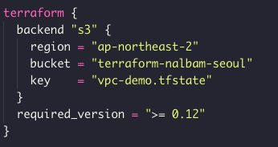
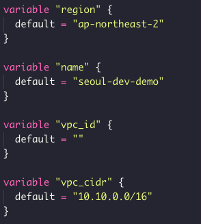
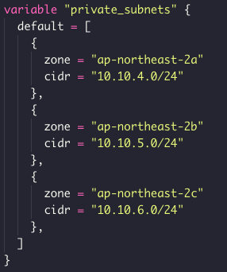
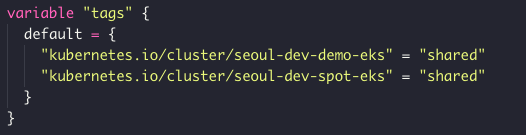
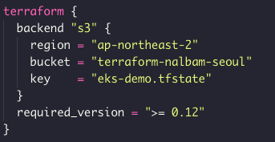

# AWS EKS

## with

# Terraform

<!--s-->

## Kubernetes

<!--v-->

* 컨테이너 작업을 자동화하는 오픈소스 플랫폼

* Container Orchestration

* Cluster 는 Master 와 Nodes 로 구성

<!--v-->


<!--v-->


<!--s-->

# EKS

<!--v-->

* Amazon Elastic Container Service for Kubernetes

* AWS 의 Kubernetes 관리형 서비스

<!--v-->


<!--s-->

# Terraform

<!--v-->

* 서비스 환경을 구축하는 프로비저닝 도구

* Infrstructure as Code

<!--s-->

# Prepare

<!--v-->

> AWS Account

* Access Key, Secret Access Key

<!--v-->

> 관리 리소스 메타 저장소

* AWS S3 Bucket

* terraform-nalbam-seoul

<!--v-->

> Install Tools

* awscli
* terraform
* kubectl
* helm

<!--s-->

# AWS VPC

<!--v-->

* Amazon Virtual Private Cloud

* 사용자가 정의한 가상 네트워크

* VPC, Subnets, Route Tables

<!--v-->

```bash
git clone https://github.com/nalbam/terraform-aws-vpc
```

<!--v-->


<!--v-->



<!--v-->



<!--v-->


<!--v-->



<!--v-->



<!--v-->

> terraform apply

<!--v-->


<!--s-->

# AWS EKS

<!--v-->

```bash
git clone https://github.com/nalbam/terraform-aws-eks
```

<!--v-->


<!--v-->



<!--v-->

> terraform apply

<!--v-->


<!--s-->

# Helm-cui

<!--s-->

# Thank you
