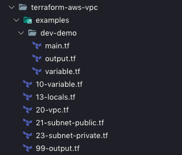
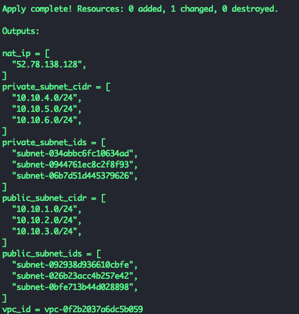
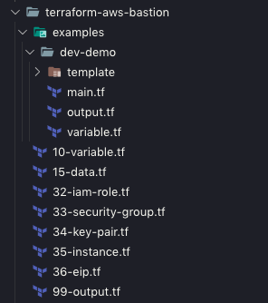
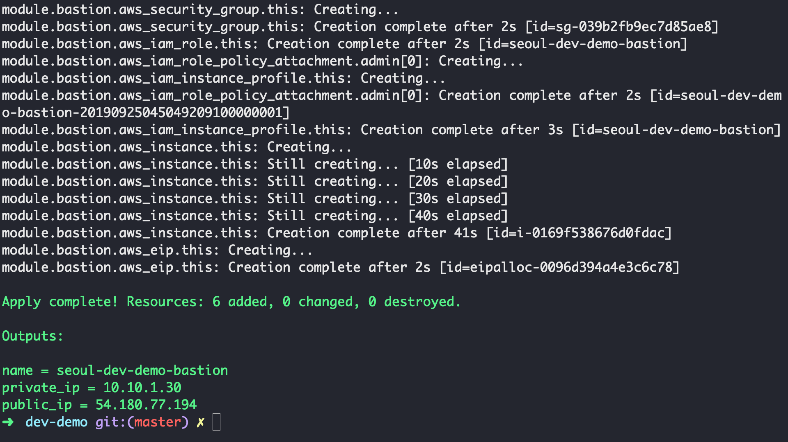
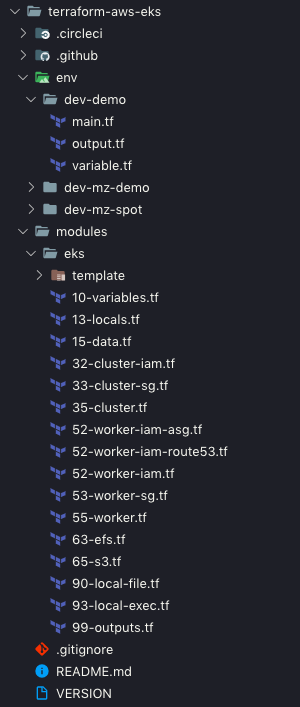
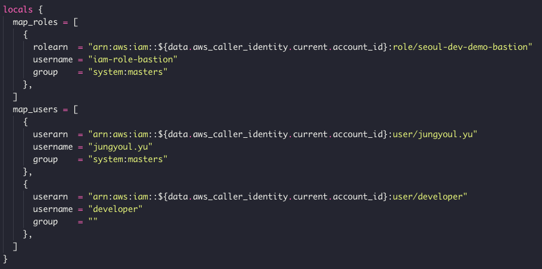
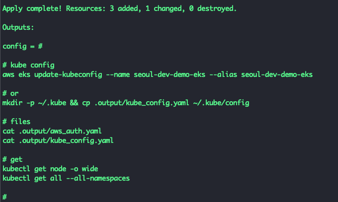
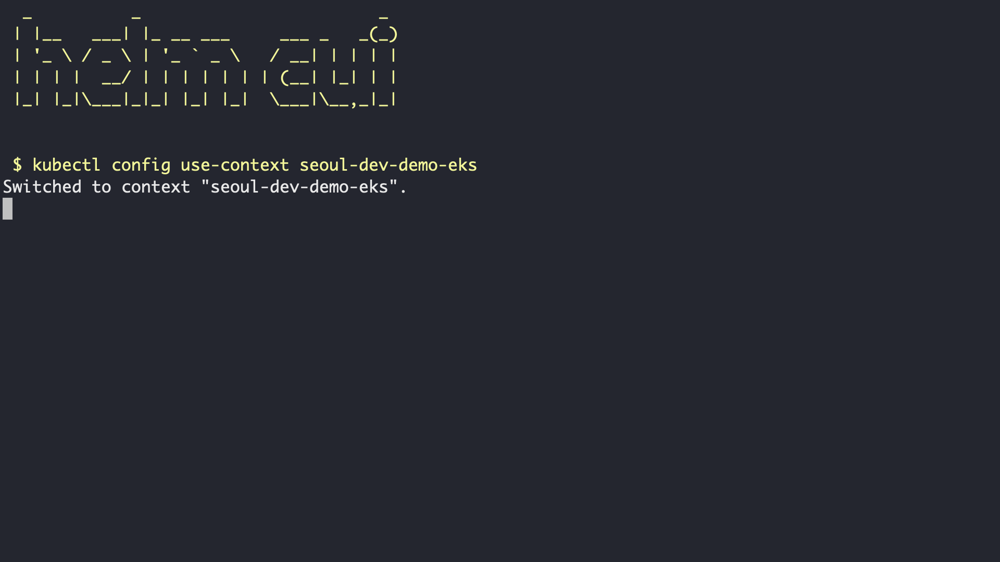

# AWS EKS

## with

# Terraform

<!--s-->

## Kubernetes

<!--v-->

* 컨테이너 작업을 자동화하는 오픈소스 플랫폼

* Container Orchestration

* Cluster 는 Master 와 Nodes 로 구성

<!--v-->


<!--v-->


<!--s-->

# EKS

<!--v-->

* Amazon Elastic Container Service for Kubernetes

* AWS 의 Kubernetes 관리형 서비스

<!--v-->


<!--s-->

# Terraform

<!--v-->

* 서비스 환경을 구축하는 프로비저닝 도구

* Infrstructure as Code

<!--s-->

# Prepare

<!--v-->

> AWS Account

* Access Key, Secret Access Key

<!--v-->

> 관리 리소스 메타 저장소

* AWS S3 Bucket

* terraform-nalbam-seoul

<!--v-->

> Install Tools

* terraform

* kubectl

* awscli

* aws-iam-authenticator

* helm

<!--s-->

# VPC

<!--v-->

* Amazon Virtual Private Cloud

* 사용자가 정의한 가상 네트워크

* VPC, Subnets, Route Tables

<!--v-->

<!-- .slide: data-background="images/terraform_vpc_ach.png" -->

<!--v-->

```bash


$ git clone https://github.com/nalbam/terraform-aws-vpc


```

<!--v-->



<!--v-->

```
terraform {
  backend "s3" {
    region = "ap-northeast-2"
    bucket = "terraform-nalbam-seoul"
    key    = "vpc-demo.tfstate"
  }
  required_version = ">= 0.12"
}
```

<!--v-->

```
variable "region" {
  default = "ap-northeast-2"
}
```
```
variable "name" {
  default = "seoul-dev-demo"
}
```
```
variable "vpc_id" {
  default = ""
}
```
```
variable "vpc_cidr" {
  default = "10.10.0.0/16"
}
```

<!--v-->

```
variable "public_subnets" {
  default = [
    {
      zone = "ap-northeast-2a"
      cidr = "10.10.1.0/24"
    },
    {
      zone = "ap-northeast-2b"
      cidr = "10.10.2.0/24"
    },
    {
      zone = "ap-northeast-2c"
      cidr = "10.10.3.0/24"
    },
  ]
}
```

<!--v-->

```
variable "private_subnets" {
  default = [
    {
      zone = "ap-northeast-2a"
      cidr = "10.10.4.0/24"
    },
    {
      zone = "ap-northeast-2b"
      cidr = "10.10.5.0/24"
    },
    {
      zone = "ap-northeast-2c"
      cidr = "10.10.6.0/24"
    },
  ]
}
```

<!--v-->

```
variable "tags" {
  default = {
    "kubernetes.io/cluster/seoul-dev-demo-eks" = "shared"
    "kubernetes.io/cluster/seoul-dev-spot-eks" = "shared"
  }
}
```

<!--v-->

```


$ terraform apply


```

<!--v-->



<!--s-->

# Bastion

<!--v-->

* 내부망의 서버에 접근하기 위한 게이트

<!--v-->

```bash


$ git clone https://github.com/nalbam/terraform-aws-bastion


```

<!--v-->



<!--v-->

```
terraform {
  backend "s3" {
    region = "ap-northeast-2"
    bucket = "terraform-nalbam-seoul"
    key    = "bastion.tfstate"
  }
  required_version = ">= 0.12"
}
```

<!--v-->

```
variable "region" {
  default = "ap-northeast-2"
}
```
```
variable "name" {
  default = "seoul-dev-demo-bastion"
}
```
```
variable "vpc_id" {
  default = "vpc-050facec749c33357"
}
```
```
variable "subnet_id" {
  default = "subnet-0dc7b46f475b61086"
}
```

<!--v-->

```
variable "administrator" {
  default = true
}
```
```
variable "key_name" {
  default = "nalbam-seoul"
}
```
```
data "template_file" "setup" {
  template = file("template/setup.sh")

  vars = {
    HOSTNAME = var.name
  }
}
```

<!--v-->

```


$ terraform apply


```

<!--v-->



<!--v-->


<!--s-->

# EKS

<!--v-->

<!-- .slide: data-background="images/terraform_eks_ach.png" -->

<!--v-->

```bash


$ git clone https://github.com/nalbam/terraform-aws-eks


```

<!--v-->



<!--v-->

```
terraform {
  backend "s3" {
    region = "ap-northeast-2"
    bucket = "terraform-nalbam-seoul"
    key    = "eks-demo.tfstate"
  }
  required_version = ">= 0.12"
}
```

<!--v-->

```
variable "region" {
  default = "ap-northeast-2"
}
```
```
variable "name" {
  default = "seoul-dev-demo-eks"
}
```
```
variable "kubernetes_version" {
  default = "1.14"
}
```

<!--v-->

```
variable "vpc_id" {
  default = "vpc-075279b4e48b983ff"
}
```
```
variable "subnet_ids" {
  default = [
    "subnet-08a5b599722126606",
    "subnet-08d4e11f445bb207f",
    "subnet-0706fbc7ebe262da7",
  ]
}
```

<!--v-->



<!--v-->

```
variable "launch_configuration_enable" {
  default = false
}
```
```
variable "launch_template_enable" {
  default = true
}
```
```
variable "launch_each_subnet" {
  default = false
}
```
```
variable "associate_public_ip_address" {
  default = true
}
```

<!--v-->

```
variable "instance_type" {
  default = "m5.large"
}
```
```
variable "mixed_instances" {
  default = ["c5.large", "r5.large"]
}
```
```
variable "volume_type" {
  default = "gp2"
}
```
```
variable "volume_size" {
  default = "32"
}
```

<!--v-->

```
variable "min" {
  default = "2"
}
```
```
variable "max" {
  default = "5"
}
```
```
variable "on_demand_base" {
  default = "1"
}
```
```
variable "on_demand_rate" {
  default = "25"
}
```

<!--v-->

```


$ terraform apply


```

<!--v-->



<!--v-->

```bash

$ aws eks update-kubeconfig \
    --name seoul-dev-demo-eks \
    --alias seoul-dev-demo-eks


```

<!--v-->

```bash
$ kubectl get nodes

NAME             STATUS   ROLES    AGE     VERSION
ip-10-10-4-131   Ready    <none>   5d14h   v1.14.6-eks-5047ed
ip-10-10-6-48    Ready    <none>   5d14h   v1.14.6-eks-5047ed
```

<!--s-->

# Helm-cui

<!--v-->

```


$ git clone https://github.com/nalbam/helm-cui


```

<!--v-->

```


$ ./helm-cui/run.sh


```

<!--v-->



<!--v-->


<!--s-->

# Thank you
